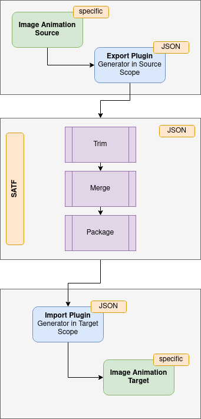
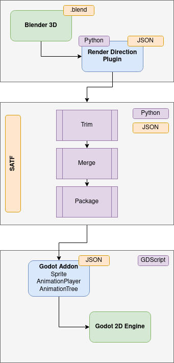

# SATF
Sprite Animation Transmission Format

This project offers one solution for the problem to transfer 2D animations based on sprite sheets from one tool stack / framework to another. A tool could use this format direct or just import it into it's own format.

## Architecture Overview


## Reference Implementation (Blender => Godot)


This project will concentrate on defining a JSON format and offer some reference implementations.

## JSON Format defintion
Below is a short snippet about how the JSON format. The format definion is a work in progress and will be specified while development of the reference implementation.
```
   ...(header)...
    "fps": 7.5,
    "animations": {
        "dying": {
            "S": [
                {
                    "name": "dying_180_001",
                    "origin": {
                        "x": 39,
                        "y": 151
                    },
                    "rect": {
                        "x": 3090,
                        "y": 712,
                        "w": 71,
                        "h": 159
                    }
                },
    (more animations)
```
Tools currently used and to be described:
- https://www.blender.org/
- https://github.com/jasonicarter/create-isocam
- https://github.com/andreas-volz/blender-render-direction
- https://github.com/brean/python-txtrpacker
- https://godotengine.org/
