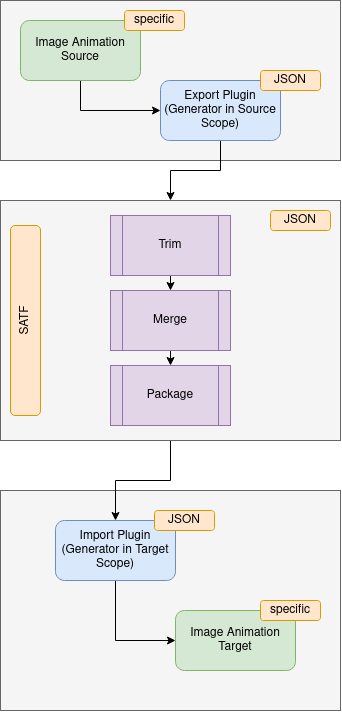

# SATF
Sprite Animation Transmission Format

This project offers one solution for the problem to transfer 2D animations based on sprite sheets from one tool stack / framework to another. A tool could use this format direct or just import it into it's own format.

## Architecture Overview

## Reference Implementation (Blender => Godot)

This project will concentrate on defining a JSON format and offer some reference implementations.

Tools currently used and to be described:
- https://www.blender.org/
- https://github.com/jasonicarter/create-isocam
- https://github.com/andreas-volz/blender-render-direction
- https://github.com/brean/python-txtrpacker
- https://godotengine.org/

